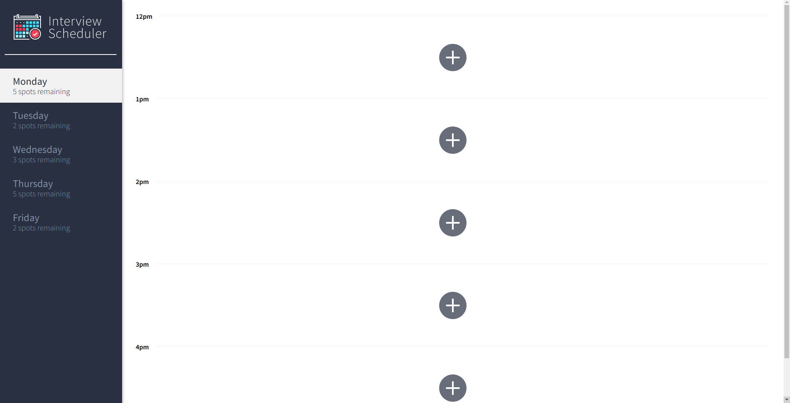

# Interview Scheduler
Interview Scheduler is a Single Page React application that allows students to book and cancel interviews. Tested extensively using Jest and Cypress.


Displays current interviews for a given day.


Display options to add a new interview.


A user is able to create and add a new interview.


The spots remaining and interview are updated!

## Setup

Install dependencies with `npm install`.

## Running Webpack Development Server

```sh
npm start
```

## Running Jest Test Framework

```sh
npm test
```

## Running Storybook Visual Testbed

```sh
npm run storybook
```
